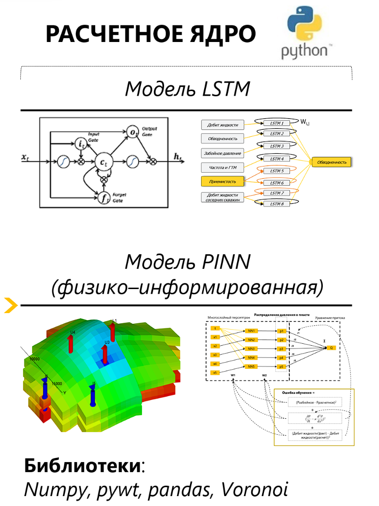
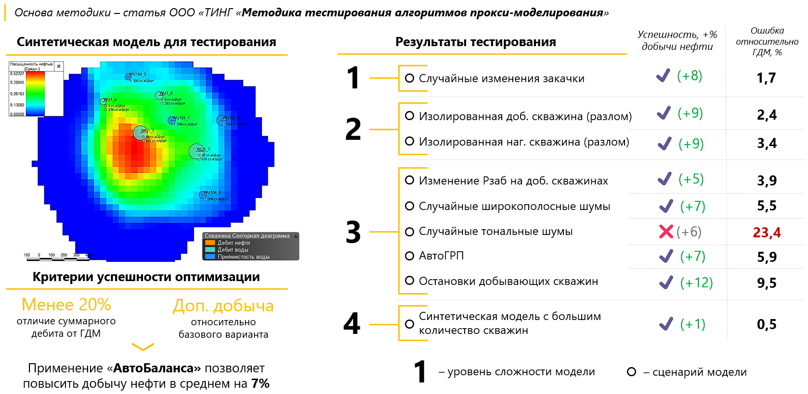
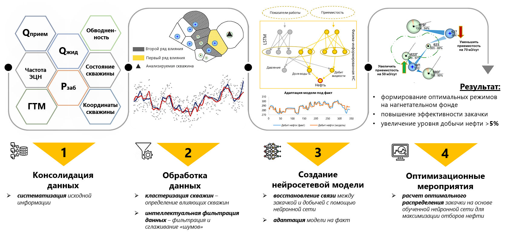

# Autobalance - нейросетевое управление заводнением

*Данный репозиторий создан с целью краткого ознакомления с проектом **AutoBalance**. Представленные материалы опубликованы в открытых источниках и на публичных научных конференциях. Репозиторий не содержит исходный код проекта.*

## Введение

Более 90% нефтяных месторождений применяют систему поддержания пластового давления, используя воду как агент закачки. Цель заводнения пласта - поддержание и увеличение отборов нефти, относительно варианта разработки на истощении.

Процесс заводнения характеризуется как:
* Нестационарный
* Инерционный
* Возможно наличие сложных комплексных влияний

Эти особенности делают процесс нетривиальной задачей.

Также важно отметить, что эффект от ППД значительно зависит от оперативного управления системой заводнения. Традиционный подход - **ручной инженерный анализ**.

У такого подхода есть ограничения:

**Неопределенность.** Вручную достаточно сложно определить степень влияния нагнетательной скважины.

**Субъективность.** Решение сильно зависят от опыта инженеров нефтяников.

**Трудозатратность.** Чаще всего, инженерный анализ не подходит для оперативной оценки.

Соответственно, для максимальной эффективности системы ППД требуется совершенствование существующего подхода к регулированию закачки для реализации потенциала заводнения.

Одним из возможных решений является примение методов искусственного интеллекта, а именно - **машинное обучение**.

Поэтому, целью нашей работы является создание единого инструмента, позволяющего оперативно определять оптимальное распределение закачки воды в нагнетательных скважинах  с помощью методики **нейросетвеого анализа**. Таким инструментом является - **ПК AutoBalance**, включающий в себя работу с большими данными, автоматизацию и стандартизацию.  

## Схема и принцип работы ПК AutoBalance

Инструмент состоит из 4 основных блоков:
* Консолидация данных
* Обработка данны
* Создание и обучение нейросетевой модели
* Решение оптимизационной задачи.

Итогом работы инструмента является формирование оптимальных режимов на нагнетательном фонде и прогнозных профилей добычи нефти/жидкости по каждой добывающей скважине.

В основе расчетного ядра лежат 2 модели нейросетевого моделирования:

* Первая модель - физико-информированная нейронная сеть для моделирования притока жидкости к добывающей скважине, основанная на модели многослойного персептрона и аппроксимации уравнения пьезопроводности.

* Вторая модель - Рекуррентная нейронная сеть LSTM, позволяющая учитывать временной лаг между параметрами и получить точный прогноз обводненности продукции до 90 дней.

В комплексе две модели образуют мощный математический аппарат, позволяющий оперативно и точно спрогнозировать и оптимизировать процессы заводнения пласта.

Autobalance - реализован в гибридном формате. 

* **Интерфейс и взаимодействие с пользователем** выполняется через книгу Excel, с помощью VBA. 

* **Расчетное ядро** полностью написано на языке Python, без библиотек машинного обучения, все алгоритмы имеют авторскую реализацию и легко внедряются в любое ПО и главное - прототип не требует наличия Python интерпретатора на компьютере пользователя.

Алгоритмы были протестированы на двух реальных месторождениях. Успешность адаптации составляет в обоих случаях более 90% - то есть по 90% скважин получен высокоточный ретроперспективный прогноз добычи нефти с ошибкой не более 5-7%. Примеры адаптации в разрезе скважин приведены на рисунке ниже. Алгоритмы успешно адаптируют все 3 параметра добычи: дебит нефти, жидкости и обводненность. Следовательно обучение модели можно в дальнейшем использовать для решения оптимизационной задачи по распределению закачки.

Тестирование алгоритмов оптимизации проводилось на основе опубликованной методики ТИНГ на девяти синтетических моделях, каждая из которых имеет свой сценарий разработки.

Важно отметить, что в тесте проверялись возможности расчетного ядра, а не всего инструмента. По результатам тестов расчетное ядро AutoBalance успешно оптимизировало 8 из 9 моделей, не решив только задачу с искусственно добавленными шумами. Для нивелирования влияния шумов в расчетное ядра в дополнительный инструмент для фильтраии шумов.

## Результаты проекта

AutoBalance:
1) Успешно представлен на 7-ми научно-технических конференциях

2) Опробован на реальных месторождениях и принес компании доп. доход 2.7 млрд за один год

3) Позволил сократить ежемесячные затраты на формирование рекомендаций по процессу управления заводнением. Экономия 4 млн.руб в год на одно управление.

## Содержание

1. Актуальность и проблематика
2. Особенности нейросетевого моделирования и предпосылки к интеграции в процессы УЗ
3. Приниципиальная схема инструмента Autobalance  
    3.1. Модель данных нейросетевой модели  
    3.2. Модуль кластеризации  
    3.3. Модуль интелектуальной обработки данных  
    3.4. Принцип работы рекуррентных нейронных сетей  
    3.5. Модуль оптимизации
4. Авторская реализация расчетного ядра
5. Тестирование  
    5.1. Тестирование алгоритмов адаптации  
    5.2. Тестирование функционала оптимизации на синтетических данных
6. Экономическая эффективность  
7. Заключение  
8. Бонус  
    8.1. Алгоритм обработки данных  
    8.2. Принцип обучения нейронной сети

## 1. Актуальность и проблематика

### ***Проблематика:***  
Не существует единой **автоматизированной** системы принятия решений для повышения эффективности управления заводнением в условиях увеличенной **дискретности** замеряемых данных.

### ***Цель работы:***  
Разработать инструмент, позволяющий **оперативно определять оптимальное распределение** закачки воды в нагнетательных скважинах с помощью нейросетевого моделирования.

## 2. Особенности нейросетевого моделирования и предпосылки к интеграции в процессы УЗ

## 3. Принципиальная схема ПК "Автобаланс"

### 3.1. Модель данных нейросетевой модели

### 3.2. Модуль кластеризации

### 3.3. Модуль интеллектуальной обработки данных

### 3.4. Принцип работы рекуррентных нейронных сетей

### 3.5. Модуль оптимизации

## 4. Авторская реализация расчетного ядра

## 5. Тестирование

### 5.1. Тестирование алгоритмов адаптации

### 5.2. Тестирование функционала оптимизации на синтетических данных

## 6. Экономическая эффективность

## 7. Заключение  
## 8. Бонус  
### 8.1. Алгоритм обработки данных  
### 8.2. Принцип обучения нейронной сети
